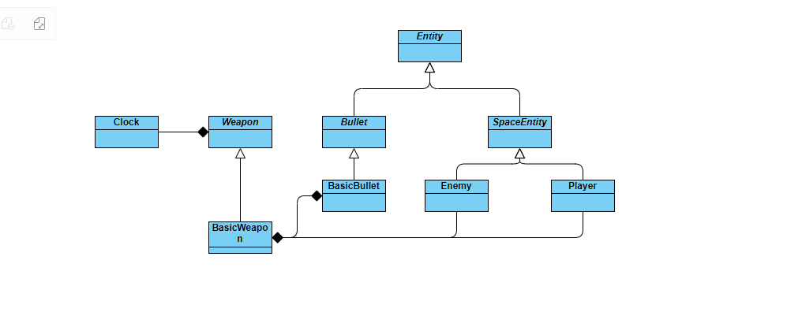

# Compte Rendu du 27/10/2023 à 09h30

### Membres présents : Ziad, Rayane, Alexandre

## Objectif : Restructuration du code 

<ul>
<li> Créer une super classe abstraite <b>Entity</b> qui sera mère de la classe mère actuelle <b>SpaceEntity</b>,
permettant ainsi de lier la classe abstraite <b>Bullet</b> et <b>SpaceEntity</b> ensemble (mêmes méthodes 
pour la position, la hitbox etc).</li>
</ul>

### Ajouts futurs : Création d'une scène d'accueil 

<ul>
<li> L'idée est de créer un Main menu, pour accéder aux différents modes de jeu, quitter le jeu, afficher des options,etc.
Une classe <b>ViewManager</b> est par conséquent en cours de programmation.</li>
</ul>
