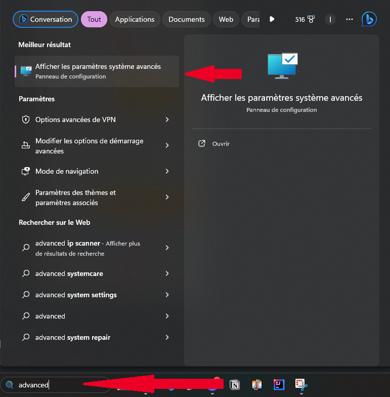
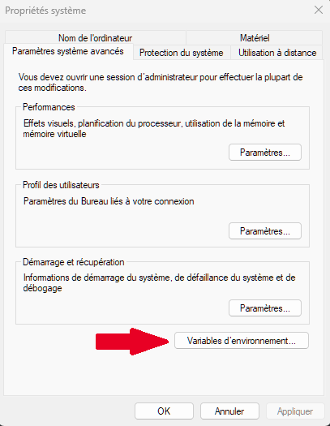
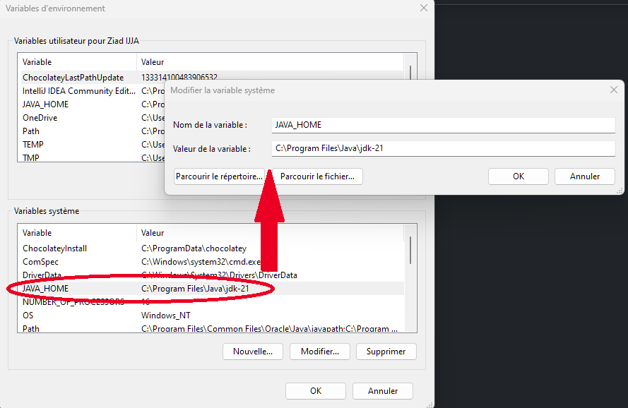
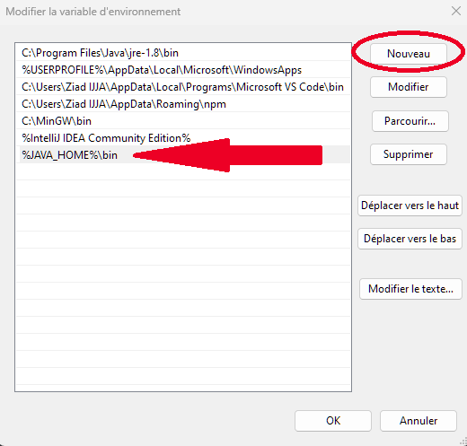

#### poo23.24.24

# Galactic Shooter

## Présentation du projet

Galactic Shooter est un jeu de tir à la vue du dessus en 2D réalisé en Java grâce à l'interface graphique JavaFX.

## Création de vague personnalisée
Pour créer des vagues de jeu personnalisées, il faut modifier le fichier source "WaveData.txt"  
Ce fichier doit être formaté de la manière suivante :

Chaque vague d'ennemis commence par **START** et fini par **END**, chacun sur une ligne seule  
**Attention : Le marqueur de fin de la dernière vague est ENDF**  
Chaque ligne definira ensuite un nouvel ennemi :  
Tout d'abord le type d'entité voulu puis sa position en X et celle en Y. Chaque donnée est séparée par un ' / '.  
Pour ajouter des ennemies après un certain temps dans la même vague : utiliser / T / <temps en secondes> après les coordonnée de l'ennemie.

Voici un exemple de 2 vagues, la première contient un CosmicCharger en X:150 ; Y:30. La deuxième contient le même que la vague 1 ainsi qu'un ennemi LongShooter en X:150 ; Y:250 et qui apparaîtera au bout de 5.3 secondes :

```
START  
CosmicCharger / 150 / 30  
END
START
CosmicCharger / 150 / 30
LongShooter / 150 / 250 / T / 5.3
ENDF
```

## Executer le projet

### Sur Linux :

1- Vérifier si Maven est installé sur votre machine 
```
mvn -v
```

Si maven n'est pas installé : 
```
sudo apt update
sudo apt install maven
```

2- Aller dans le repertoire du projet 
```
cd poo23.24.24
```

3- Executer la commande suivante
```
mvn clean javafx:run 
```

### Sur Windows :
Pour lancer le projet, maven n'as pas besoin d'être installé, néanmoins il est nécessaire de configurer les variables d'environnement pour y inclure le jdk.

1- Aller dans les propriétés système



2- Aller dans les variables d'environnement 



3- Ajouter la variable système JAVA_HOME

Cette variable doit mener à votre jdk



Attention, inclure le dossier entier, pas le sous dossier /bin !

4- Mettre à jour la variable Path



Ici il faut ajouter :
```
%JAVA_HOME%\bin 
```

5- Aller dans le repertoire du projet 
```
cd poo23.24.24
```

6- Executer la commande suivante
```
mvnw.cmd clean javafx:run 
```

## Auteurs
Ziad Ijja  
Victorien Le Fur  
Alexandre Paradis  
Rayane Tabti
